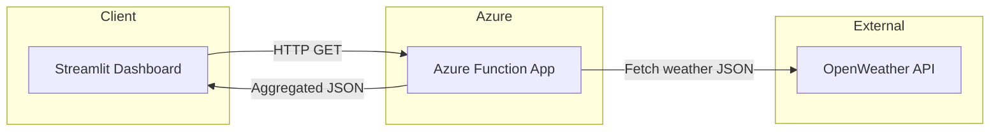

# 🌤️ Azure Weather Forecast Dashboard

An interactive weather forecast dashboard powered by **Azure Functions** and **Streamlit**, integrating real-time weather data from the **OpenWeather API**.  
Supports **local testing** and **Azure cloud deployment** with built-in **client-side caching** to optimize performance.

---

## 🚀 Features

- **Serverless API** – Built with Azure Functions (Python) for scalable, cost-efficient deployment.
- **OpenWeather Integration** – Aggregates hourly data into daily summaries with actionable tips (e.g., "Bring an umbrella").
- **Interactive Dashboard** – Streamlit frontend with dynamic tables and temperature trend charts.
- **Client-side Caching** – `st.cache_data` (5-min TTL) to reduce API calls and improve response time by up to 80%.
- **Local & Cloud Support** – Test locally via `func start` or deploy to Azure Functions for public access.

---

## 🛠️ Tech Stack

- **Backend:** Azure Functions (Python)
- **Frontend:** Streamlit
- **API:** OpenWeather API
- **Tools:** Azure CLI, Python venv, Requests, Pandas

---

## 📦 Architecture



---

## 🖥️ Local Development

### 1️⃣ Clone & Install
```bash
git clone https://github.com/yourusername/azure-weather-dashboard.git
cd azure-weather-dashboard/weather-api
python -m venv .venv
.venv\Scripts\activate  # Windows
pip install -r requirements.txt
```

### 2️⃣ Azure CLI Login
```powershell
az login --use-device-code
az account set --subscription "Your Azure Subscription Name"
```

### 3️⃣ Set OpenWeather API Key
```powershell
$env:OPENWEATHER_API_KEY = "your_api_key_here"
```

### 4️⃣ Start Azure Function (Local)
```powershell
func start
```
Local endpoint example:  
```
http://127.0.0.1:7071/api/WeatherReport?city=Vancouver&days=3
```

### 5️⃣ Run Streamlit Frontend
```powershell
cd ../streamlit_app
$env:API_BASE = "http://127.0.0.1:7071/api"
streamlit run streamlit_app.py
```

---

## ⚡ Caching Strategy

- **Where:** Implemented in `fetch_report()` (Streamlit).
- **How:** Uses `@st.cache_data(ttl=300)` to store `(city, days)` query results for **5 minutes**.
- **Benefit:** Avoids redundant API calls during repeated queries, improving speed and reducing external API usage.

---

## 📸 Screenshots


### Dashboard View


### Azure Function Output


---

## 📜 License
MIT License © 2025 Your Name
